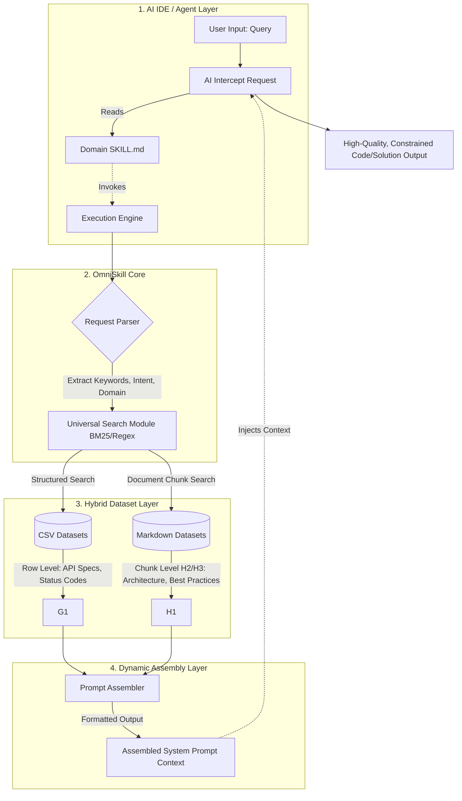

# OmniSkill Framework

A universal Agentic-RAG skill framework that enables developers to create domain-specific AI skills with minimal effort.

## Overview

OmniSkill is a zero-dependency Agentic-RAG framework that provides:

- **Hybrid Dataset Support**: Seamlessly handle both CSV (structured) and Markdown (unstructured) data sources
- **BM25 Search**: Pure local BM25-based retrieval without external dependencies
- **Tag-based Filtering**: Filter by data type and custom tags
- **Dynamic Assembly**: Format search results as XML or Markdown for LLM consumption
- **CLI Scaffolding**: One-command skill generation with proper directory structure

## Installation

### Using uv (Recommended)

```bash
uv add omniskill
```

### Using pip

```bash
pip install omniskill
```

### From Source

```bash
git clone https://github.com/longcipher/omni-skill.git
cd omni-skill
uv sync --all-groups
```

## Quick Start

### 1. Create a New Skill

```bash
omniskill create backend-api-master
```

This creates a skill directory with:

- `SKILL.md` - Instructions for LLMs
- `datasets/` - Directory for your knowledge base
- `__init__.py` - Python module stub

### 2. Add Your Knowledge Base

Place your CSV and Markdown files in the `datasets/` directory:

```bash
# Add API conventions
echo "pattern,description,example
snake_case,Use snake_case for endpoints,/api/v1/user_profiles" > skills/backend-api-master/datasets/api_standards.csv

# Add authentication patterns
cat > skills/backend-api-master/datasets/auth_patterns.md << EOF
## JWT Authentication

Use JSON Web Tokens for API authentication.

### Implementation

\`\`\`python
import jwt
from datetime import datetime, timedelta

def create_jwt_token(user_id: str, secret_key: str) -> str:
    payload = {
        "user_id": user_id,
        "exp": datetime.utcnow() + timedelta(hours=24)
    }
    return jwt.encode(payload, secret_key, algorithm="HS256")
\`\`\`
EOF
```

### 3. Search Your Knowledge Base

```bash
# Search for API design patterns
omniskill search "API design patterns" --skill-dir skills/backend-api-master

# Search with XML output
omniskill search "JWT authentication" --skill-dir skills/backend-api-master --format xml

# Search with Markdown output
omniskill search "database best practices" --skill-dir skills/backend-api-master --format markdown

# Search with filtering
omniskill search "API" --skill-dir skills/backend-api-master --type markdown --tag auth
```

## Architecture



## CLI Reference

### Create Command

Create a new OmniSkill:

```bash
omniskill create <skill-name> [--force]
```

**Options:**

- `--force, -f`: Overwrite existing skill directory

**Example:**

```bash
omniskill create my-api-skill
```

### Search Command

Search skill knowledge base:

```bash
omniskill search <query> --skill-dir <path> [options]
```

**Options:**

- `--skill-dir, -d`: Path to skill directory (required)
- `--format, -f`: Output format (xml, markdown) [default: xml]
- `--limit, -l`: Maximum number of results [default: 10]
- `--type, -t`: Filter by document type (csv, markdown)
- `--tag`: Filter by tag (can be used multiple times)
- `--metadata`: Include BM25 scores and metadata
- `--verbose, -v`: Enable verbose output

**Examples:**

```bash
# Basic search
omniskill search "API authentication" --skill-dir skills/my-skill

# Search with XML output
omniskill search "database" --skill-dir skills/my-skill --format xml

# Search with filtering
omniskill search "API" --skill-dir skills/my-skill --type markdown --tag auth

# Search with limit
omniskill search "python" --skill-dir skills/my-skill --limit 5
```

## Python API Reference

### SearchEngine

The main entry point for indexing and searching:

```python
from omniskill.core.engine import SearchEngine
from omniskill.core.assembler import OutputFormat

# Initialize search engine
engine = SearchEngine()

# Index a directory
documents = engine.index_directory("skills/my-skill")

# Search for content
results = engine.search("API design", limit=10)

# Search with filtering
results = engine.search("API", doc_type="markdown", tags=["auth"])

# Assemble results
from omniskill.core.assembler import PromptAssembler
assembler = PromptAssembler()
output = assembler.assemble(results, output_format=OutputFormat.XML)
print(output)
```

### BM25Searcher

Low-level BM25 search implementation:

```python
from omniskill.core.search import BM25Searcher
from omniskill.models import Document

# Create searcher
searcher = BM25Searcher(k1=1.5, b=0.75)

# Add documents
docs = [
    Document(id="1", source="api.csv", content="Use snake_case", metadata={}, tags=()),
    Document(id="2", source="auth.md", content="Use JWT tokens", metadata={}, tags=()),
]
searcher.add_documents(docs)

# Search
results = searcher.search("snake_case", limit=10)
```

### PromptAssembler

Format search results for LLM consumption:

```python
from omniskill.core.assembler import PromptAssembler, OutputFormat

assembler = PromptAssembler(max_context_length=4000)

# XML format
xml_output = assembler.assemble(results, output_format=OutputFormat.XML)

# Markdown format
md_output = assembler.assemble(results, output_format=OutputFormat.MARKDOWN)
```

## Examples

### Backend API Master Skill

A complete example skill for backend API development:

```bash
# Create the skill
omniskill create backend-api-master

# Add knowledge base files
cp examples/backend-api-master/datasets/* skills/backend-api-master/datasets/

# Search for API patterns
omniskill search "API design patterns" --skill-dir skills/backend-api-master

# Search for authentication
omniskill search "JWT authentication" --skill-dir skills/backend-api-master

# Search for database best practices
omniskill search "database connection pooling" --skill-dir skills/backend-api-master
```

## Contributing

### Development Setup

1. Clone the repository:

```bash
git clone https://github.com/longcipher/omni-skill.git
cd omni-skill
```

2. Install dependencies:

```bash
uv sync --all-groups
```

3. Run tests:

```bash
just test
```

4. Run BDD tests:

```bash
just bdd
```

5. Run linting:

```bash
just lint
```

6. Run type checking:

```bash
just typecheck
```

### Common Commands

```bash
just format      # Format code
just lint        # Run linter
just test        # Run unit tests
just bdd         # Run BDD tests
just test-all    # Run all tests
just build       # Build package
just typecheck   # Run type checker
```

### Adding New Features

1. Write a failing Gherkin scenario in `features/*.feature`
2. Write a failing `pytest` test for the inner domain logic
3. Implement the feature
4. Re-run `just test` to verify tests pass
5. Re-run `just bdd` to verify acceptance behavior

## License

Apache-2.0
