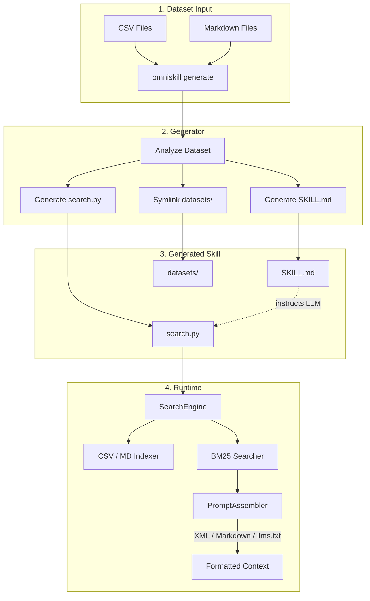

# OmniSkill

A skill generator that turns CSV and Markdown datasets into ready-to-use Agentic-RAG skills with a single command.

## Overview

OmniSkill analyzes your dataset directory and generates:

- **`SKILL.md`** — Skill specification document that tells LLMs how to use the knowledge base
- **`search.py`** — Standalone Python script for BM25-based retrieval against the dataset
- **`datasets/`** — Symlinked source data for the generated skill

It also provides a CLI for manually creating skill scaffolding and searching knowledge bases.

## Installation

### Using uv (Recommended)

```bash
uv add omniskill
```

### Using pip

```bash
pip install omniskill
```

### From Source

```bash
git clone https://github.com/longcipher/omni-skill.git
cd omni-skill
uv sync --all-groups
```

## Quick Start

### Generate a Skill from a Dataset

Point OmniSkill at any directory containing CSV and/or Markdown files:

```bash
omniskill generate examples/backend-api-master
```

This analyzes the dataset files and produces a complete skill under `skills/<dataset-name>/`:

```text
skills/backend-api-master/
  SKILL.md      # Skill specification for LLMs
  search.py     # Standalone search script
  datasets/     # Symlink to source data
```

### Use the Generated Skill

The generated `search.py` can be run directly:

```bash
python skills/backend-api-master/search.py "API design best practices"
```

Or use the CLI:

```bash
omniskill search "API design best practices" --skill-dir skills/backend-api-master
```

### Custom Options

```bash
# Custom skill name and output directory
omniskill generate my-datasets/ --name my-skill --output out/my-skill/

# Verbose mode shows dataset analysis details
omniskill generate my-datasets/ --verbose
```

## Architecture



## CLI Reference

### `generate` — Generate a Skill from Datasets

```bash
omniskill generate <dataset-dir> [options]
```

**Arguments:**

- `dataset-dir` — Path to a directory containing CSV and/or Markdown files

**Options:**

- `--name, -n` — Skill name (defaults to the dataset directory name)
- `--output, -o` — Output directory (defaults to `skills/<skill-name>/`)
- `--verbose, -v` — Show dataset analysis details

**Example:**

```bash
omniskill generate data/api-specs/ --name api-assistant --output skills/api-assistant/
```

### `create` — Create Skill Scaffolding

Create an empty skill directory with template files:

```bash
omniskill create <skill-name> [--force]
```

**Options:**

- `--force, -f` — Overwrite existing skill directory

### `search` — Search a Knowledge Base

```bash
omniskill search <query> --skill-dir <path> [options]
```

**Options:**

- `--skill-dir, -d` — Path to the skill directory (required)
- `--format, -f` — Output format: `xml`, `markdown` (default: `xml`)
- `--limit, -l` — Maximum number of results (default: `10`)
- `--type, -t` — Filter by document type: `csv`, `markdown`
- `--tag` — Filter by tag (AND logic, repeatable)
- `--metadata` — Include BM25 scores in output
- `--verbose, -v` — Enable verbose output

## Python API

### Generate a Skill Programmatically

```python
from omniskill.core.generator import generate_skill

analysis = generate_skill(
    dataset_dir="data/my-datasets",
    skill_name="my-skill",
    output_dir="skills/my-skill",
)

print(f"Generated {analysis.skill_name} with {analysis.total_documents} documents")
```

### SearchEngine

Index and search directories of CSV/Markdown files:

```python
from omniskill.core.engine import SearchEngine
from omniskill.core.assembler import OutputFormat, PromptAssembler

engine = SearchEngine()
engine.index_directory("skills/my-skill/datasets")

results = engine.search("API design", limit=10)

assembler = PromptAssembler()
print(assembler.assemble(results, output_format=OutputFormat.XML))
```

### Dataset Analysis

Analyze a dataset directory without generating files:

```python
from omniskill.core.generator import analyze_dataset

analysis = analyze_dataset("data/my-datasets")
print(f"CSV files: {len(analysis.csv_files)}")
print(f"Markdown files: {len(analysis.markdown_files)}")
print(f"Total documents: ~{analysis.total_documents}")
```

## Output Formats

OmniSkill supports three output formats for assembled search results:

| Format | CLI Flag | Description |
|--------|----------|-------------|
| XML | `--format xml` | Structured `<context_injection>` with `<rules>` and `<reference>` sections |
| Markdown | `--format markdown` | Human-readable sections with source attribution |
| llms.txt | (in generated scripts) | Follows the llms.txt spec for LLM consumption |

## Contributing

### Development Setup

```bash
git clone https://github.com/longcipher/omni-skill.git
cd omni-skill
uv sync --all-groups
```

### Common Commands

```bash
just format      # Format code
just lint        # Run linter
just test        # Run unit tests
just bdd         # Run BDD tests
just test-all    # Run all tests
just build       # Build package
just typecheck   # Run type checker
```

### Adding New Features

1. Write a failing Gherkin scenario in `features/*.feature`
2. Write a failing `pytest` test for the inner domain logic
3. Implement the feature
4. Re-run `just test` and `just bdd` to verify

## License

Apache-2.0
