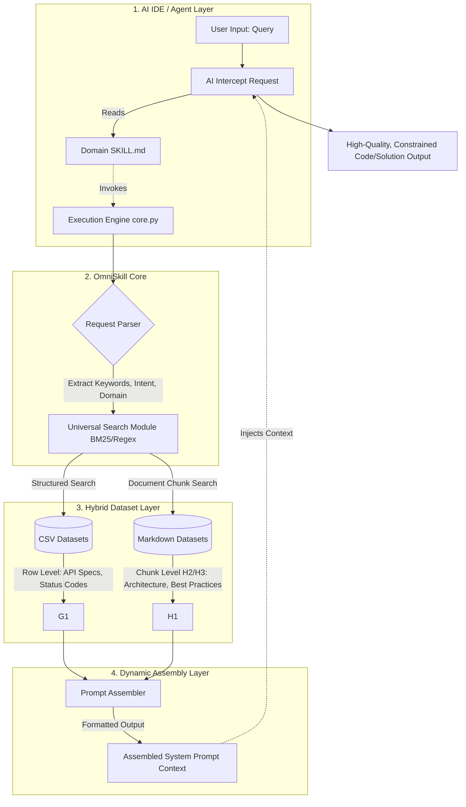

# Design: OmniSkill Framework

| Metadata | Details |
| :--- | :--- |
| **Status** | Draft |
| **Created** | 2026-03-26 |
| **Scope** | Full |

---

## Executive Summary

The OmniSkill Framework is a universal Agentic-RAG (Retrieval-Augmented Generation) skill framework designed to enable developers to create domain-specific AI skills with minimal effort. By providing a standardized scaffolding, developers can "fill in the blanks" with CSV or Markdown data to generate super skills with dynamic retrieval and on-demand assembly capabilities.

The framework's core goal is to provide a set of standard scaffolding that allows developers to generate super skills with dynamic retrieval and on-demand assembly capabilities by simply providing CSV or Markdown data in a "fill-in-the-blank" manner.

---

## Source Inputs & Normalization

### Source Material

The design document (`docs/design.md`) provides a comprehensive blueprint for the OmniSkill Framework, including:

1. **Architecture Overview**: Mermaid diagram showing the 4-layer architecture (AI IDE/Agent Layer → OmniSkill Core → Hybrid Dataset Layer → Dynamic Assembly Layer)
2. **Physical Directory Structure**: Framework directory layout with `core/`, `cli.py`, `skills/` directories
3. **Core Module Design**: Three main modules (`indexer.py`, `search_bm25.py`, `assembler.py`)
4. **Skill Auto-Generation Mechanism**: CLI workflow for creating new skills
5. **Core Advantages**: Token efficiency, unlimited knowledge expansion, zero external dependencies, elimination of AI "slop"

### Normalization Process

The source requirements were normalized into the following requirement ledger:

| ID | Requirement | Type | Priority |
|----|-------------|------|----------|
| R1 | Framework must support hybrid datasets (CSV + Markdown) | Functional | P0 |
| R2 | CSV rows must be indexed as searchable documents | Functional | P0 |
| R3 | Markdown must be chunked by headers (H2/H3) | Functional | P0 |
| R4 | BM25-based search engine must be implemented | Functional | P0 |
| R5 | Search must support tag-based routing (--type, --tag) | Functional | P1 |
| R6 | Dynamic prompt assembler must format results as XML/Markdown | Functional | P0 |
| R7 | CLI must support skill creation command | Functional | P0 |
| R8 | Generated SKILL.md must include execution instructions | Functional | P1 |
| R9 | Framework must be zero-dependency (no external DB) | Constraint | P0 |
| R10 | Implementation must use Python 3.12+ type annotations | Constraint | P0 |

### Ambiguities & Assumptions

1. **Assumption**: The framework targets local/embedded use cases (no cloud dependencies)
2. **Assumption**: CSV files have headers; first row is treated as column names
3. **Assumption**: Markdown chunking stops at H2/H3 level (not H4+) to maintain context
4. **Assumption**: BM25 implementation will use `rank-bm25` library for production-ready scoring

---

## Requirements & Goals

### Functional Goals

1. **Hybrid Dataset Support**: Framework must seamlessly handle both CSV (structured) and Markdown (unstructured) data sources
2. **Intelligent Indexing**: Automatic indexing of CSV rows and Markdown chunks with appropriate metadata
3. **BM25 Search**: Pure local BM25-based retrieval without external dependencies
4. **Tag-based Routing**: Support filtering by data type (CSV/Markdown) and custom tags
5. **Dynamic Assembly**: Intelligent prompt assembly from search results
6. **CLI Scaffolding**: One-command skill generation with proper directory structure
7. **SKILL.md Generation**: Auto-generated skill instruction files for LLM consumption

### Non-Functional Goals

1. **Zero External Dependencies**: No reliance on cloud services, vector databases, or external APIs
2. **High Performance**: Sub-100ms search latency for datasets up to 10MB
3. **Type Safety**: Full Python 3.12+ type annotation coverage
4. **Testability**: Comprehensive unit, integration, and BDD test coverage
5. **Modularity**: Clean separation between core engine, CLI, and skill implementations

### Explicit Out-of-Scope

1. **Vector Database Integration**: No Pinecone, Weaviate, or ChromaDB integration (BM25-only by design)
2. **Cloud Deployment**: No AWS/GCP/Azure deployment automation
3. **Web Interface**: No Flask/FastAPI web UI (CLI-only by design)
4. **Real-time Collaboration**: No multi-user synchronization features
5. **Advanced NLP**: No custom tokenization, stemming, or semantic search beyond BM25

---

## Requirements Coverage Matrix

| Req ID | Design Section | Scenario(s) | Task(s) | Status |
|--------|----------------|-------------|---------|--------|
| R1 | 3. Core Modules | All scenarios | T1.1, T2.1, T3.1 | Planned |
| R2 | 3.1 indexer.py | CSV indexing scenarios | T1.2 | Planned |
| R3 | 3.1 indexer.py | Markdown chunking scenarios | T1.3 | Planned |
| R4 | 3.2 search_bm25.py | Search scenarios | T2.2 | Planned |
| R5 | 3.2 search_bm25.py | Tag filtering scenarios | T2.3 | Planned |
| R6 | 3.3 assembler.py | Assembly scenarios | T3.2 | Planned |
| R7 | 4. CLI | CLI scenarios | T4.1, T4.2 | Planned |
| R8 | 4. CLI | SKILL.md scenarios | T4.3 | Planned |
| R9 | All sections | All scenarios | All tasks | Planned |
| R10 | All sections | Type checking | All tasks | Planned |

---

## Planner Contract Surface

This section defines the contract between the planning phase (`pb-plan`) and the build phase (`pb-build`).

### PlannedSpecContract

The `PlannedSpecContract` is satisfied by the following artifacts in `specs/2026-03-26-01-omniskill-framework/`:

1. **design.md**: Comprehensive design document covering architecture, modules, and implementation details
2. **tasks.md**: Actionable task breakdown with verification criteria
3. **features/*.feature**: Gherkin scenarios defining acceptance criteria

### TaskContract

Each task in `tasks.md` provides:

- **Task ID**: Unique identifier (e.g., `Task 1.1`)
- **Context**: Background and purpose
- **Requirement Coverage**: Mapping to requirement IDs
- **Scenario Coverage**: Mapping to feature scenarios
- **Loop Type**: `BDD+TDD` or `TDD-only`
- **Steps**: Checklist of implementation steps
- **Verification**: How to verify completion

### BuildBlockedPacket

A `BuildBlockedPacket` may be emitted by `pb-build` if:

1. **Missing Dependencies**: Required Python packages not available
2. **Type Errors**: `ty check` fails
3. **Test Failures**: `pytest` or `behave` failures
4. **Lint Errors**: `ruff check` failures

### DesignChangeRequestPacket

If during implementation a design change is needed:

1. **Document the Change**: Record the rationale and impact
2. **Update Artifacts**: Modify `design.md`, `tasks.md`, or feature files as needed
3. **Propagate Changes**: Ensure all dependent tasks reflect the change

---

## Architecture Overview

### System Context

The OmniSkill Framework operates in a local, embedded context where:

1. **Input**: User queries (via CLI or programmatic API)
2. **Processing**: Local BM25 search over indexed datasets
3. **Output**: Assembled prompt context for LLM consumption

### Key Design Principles

1. **Zero External Dependencies**: All functionality implemented in pure Python
2. **Modularity**: Core engine, CLI, and skills are cleanly separated
3. **Extensibility**: Plugin architecture for custom indexers, searchers, and assemblers
4. **Performance**: Local-first, sub-100ms search latency
5. **Type Safety**: Full Python 3.12+ type annotations

### Architecture Diagram



---

## Architecture Decisions

### Inherited Decisions

From the `AGENTS.md` Architecture Decision Snapshot, this project inherits:

1. **Python 3.12+ Type Annotations**: All public functions and methods must have full type annotations
2. **uv Package Management**: Dependencies managed via `uv add` / `uv add --group dev`
3. **Testing Strategy**: Gherkin + `behave` for BDD, `pytest` for TDD, `Hypothesis` for property testing
4. **Code Quality**: `ruff` for linting/formatting, `ty` for type checking
5. **Preferred Dependencies**: `orjson`, `msgspec`, `httpx`, `structlog`, `pydantic`

### New Pattern Selections

For the OmniSkill Framework, the following patterns are selected:

| Pattern | Application | Rationale |
|---------|-------------|-----------|
| **Strategy** | Indexer implementations (CSV vs Markdown) | Allows pluggable indexing strategies while maintaining common interface |
| **Factory** | Document creation based on file type | Encapsulates document creation logic, easy to extend for new file types |
| **Template Method** | Assembler output formatting | Common assembly workflow with customizable output formats (XML, Markdown) |
| **Repository** | Search interface abstraction | Decouples search implementation (BM25) from consumption |

### SRP / DIP Check

**Single Responsibility Principle:**

- `Indexer`: Only handles document creation from files
- `Searcher`: Only handles retrieval logic
- `Assembler`: Only handles prompt formatting
- `CLI`: Only handles user interaction

**Dependency Inversion Principle:**

- All external dependencies (file system, search libraries) are abstracted behind protocols
- Core modules depend on abstractions (`Document`, `SearchResult`) not concrete implementations
- BM25 implementation can be swapped without changing search consumers

### Dependency Injection Plan

External dependencies are routed through:

1. **Configuration Injection**: `OmniSkillConfig` dataclass injected at initialization
2. **Protocol-Based Injection**: `IndexerProtocol`, `SearcherProtocol`, `AssemblerProtocol` define seams
3. **Factory Injection**: `DocumentFactory`, `IndexerFactory` for extensible document handling

### Code Simplifier Alignment

The selected patterns reduce complexity by:

1. **Eliminating nested conditionals**: Strategy pattern replaces if/else chains for file type handling
2. **Clarifying control flow**: Template method makes assembly workflow explicit
3. **Reducing coupling**: Repository pattern isolates search consumers from BM25 details
4. **Improving naming**: Pattern names communicate intent (e.g., `CsvIndexingStrategy` vs `handle_csv_file`)

---

## BDD/TDD Strategy

### Primary Language

Python 3.12+

### BDD Runner

`behave`

### BDD Command

```bash
uv run behave features/
```

### Unit Test Command

```bash
uv run pytest tests/ -v
```

### Property Test Tool

`Hypothesis` - Used for property-based testing of:

- Document chunking logic (arbitrary markdown content)
- CSV parsing with various edge cases
- Search result ranking consistency

### Fuzz Test Tool

`N/A` - Fuzzing not required as the framework doesn't parse hostile binary input or protocol formats

### Benchmark Tool

`pytest-benchmark` - Used for:

- BM25 search latency benchmarks
- Document indexing throughput
- Assembly formatting performance

### Feature Files

`specs/2026-03-26-01-omniskill-framework/features/*.feature`

### Outside-in Loop

1. **Failing Gherkin**: Write scenario for CSV indexing → Run `behave` → Scenario fails
2. **Failing pytest**: Write unit test for `CsvIndexer` → Run `pytest` → Test fails
3. **Passing pytest**: Implement `CsvIndexer` → Tests pass
4. **Passing Gherkin**: Wire into feature steps → `behave` passes
5. **Property tests**: Add Hypothesis tests for edge cases
6. **Benchmark**: Add pytest-benchmark for performance baseline

---

## Code Simplification Constraints

### Behavioral Contract

Preserve existing behavior unless explicitly specified in requirements. This is a new feature implementation, so no existing behavior to preserve.

### Repo Standards

Code must follow all standards established in `AGENTS.md`:

1. **Type Annotations**: Full Python 3.12+ type annotations on all public APIs
2. **Error Handling**: Explicit exception hierarchies, no bare `except:`
3. **Async/Await**: Use `async` for I/O-bound operations
4. **Observability**: `structlog` for logging, never `print()`
5. **Tooling**: `ruff`, `ty`, `pytest`, `behave`

### Readability Priorities

1. **Explicit over implicit**: Clear control flow, no magic
2. **Descriptive naming**: `CsvDocument` not `Doc1`
3. **Reduced nesting**: Early returns, guard clauses
4. **Single responsibility**: Each function does one thing
5. **No nested ternaries**: Use clear if/else branching

### Refactor Scope

Limit cleanup to touched modules. Since this is new code, establish clean patterns from the start. No unrelated refactoring.

### Clarity Guardrails

Avoid:

- Dense one-liners that sacrifice readability
- Clever compact code that requires explanation
- Nested ternary operators
- Abstraction for abstraction's sake

Prefer:

- Explicit control flow with clear branches
- Descriptive variable and function names
- Straightforward implementations over "elegant" ones
- Comments that explain "why", not "what"

---

## BDD Scenario Inventory

### `features/indexing.feature`

- **Scenario**: CSV file indexing creates searchable documents
- **Scenario**: Markdown file chunking by H2 headers
- **Scenario**: Markdown file chunking by H3 headers

### `features/search.feature`

- **Scenario**: BM25 search returns ranked results
- **Scenario**: Tag-based filtering narrows search scope
- **Scenario**: Type-based filtering (CSV vs Markdown)

### `features/assembly.feature`

- **Scenario**: Search results assembled into XML format
- **Scenario**: Search results assembled into Markdown format
- **Scenario**: Mixed CSV and Markdown result assembly

### `features/cli.feature`

- **Scenario**: Create new skill with CLI command
- **Scenario**: Generated skill has correct directory structure
- **Scenario**: Generated SKILL.md contains proper instructions

---

## Existing Components to Reuse

The following components from the existing codebase should be reused:

1. **Project Structure**: `src/uv_app/` layout, `tests/` directory structure
2. **BDD Harness**: Existing `features/` directory with `behave` configuration
3. **Testing Patterns**: Existing `pytest` setup with `hypothesis` support
4. **Tooling**: `ruff`, `ty`, `just` commands from `Justfile`
5. **Type Patterns**: `TypedDict` patterns from `core.py`

---

## Detailed Design

### Module Structure

```text
src/omniskill/
├── __init__.py
├── __main__.py              # Entry point for python -m omniskill
├── cli.py                   # Click-based CLI implementation
├── config.py                # Configuration dataclasses
├── exceptions.py            # Custom exception hierarchy
├── protocols.py             # typing.Protocol definitions
│
├── core/                    # Core engine modules
│   ├── __init__.py
│   ├── indexer.py           # Document indexing (CSV + Markdown)
│   ├── search.py            # BM25 search implementation
│   └── assembler.py         # Prompt assembly
│
├── models/                  # Data models
│   ├── __init__.py
│   ├── document.py          # Document dataclass
│   ├── chunk.py             # Chunk dataclass
│   └── result.py            # Search result dataclass
│
└── utils/                   # Utilities
    ├── __init__.py
    ├── file_utils.py        # File I/O helpers
    └── text_utils.py        # Text processing helpers
```

### Data Structures

#### Document

```python
from dataclasses import dataclass
from typing import Any

@dataclass(slots=True, frozen=True)
class Document:
    """A searchable document."""
    id: str
    content: str
    source: str  # File path
    doc_type: str  # "csv" | "markdown"
    metadata: dict[str, Any]
    tags: list[str]
```

#### Chunk

```python
@dataclass(slots=True, frozen=True)
class Chunk:
    """A chunk of a document (for Markdown)."""
    id: str
    content: str
    source: str
    header_level: int  # 2 for H2, 3 for H3
    header_text: str
    metadata: dict[str, Any]
```

#### SearchResult

```python
@dataclass(slots=True, frozen=True)
class SearchResult:
    """A search result with BM25 score."""
    document: Document | Chunk
    score: float
    rank: int
```

### Interface Definitions

#### IndexerProtocol

```python
from typing import Protocol, runtime_checkable
from pathlib import Path

@runtime_checkable
class IndexerProtocol(Protocol):
    """Protocol for document indexers."""

    def index_file(self, file_path: Path) -> list[Document]:
        """Index a single file and return documents."""
        ...

    def index_directory(self, dir_path: Path) -> list[Document]:
        """Index all supported files in a directory."""
        ...

    def supports_file(self, file_path: Path) -> bool:
        """Check if this indexer supports the given file."""
        ...
```

#### SearcherProtocol

```python
@runtime_checkable
class SearcherProtocol(Protocol):
    """Protocol for search engines."""

    def search(
        self,
        query: str,
        limit: int = 10,
        doc_type: str | None = None,
        tags: list[str] | None = None,
    ) -> list[SearchResult]:
        """Search documents and return ranked results."""
        ...

    def add_documents(self, documents: list[Document]) -> None:
        """Add documents to the search index."""
        ...
```

#### AssemblerProtocol

```python
from enum import Enum

class OutputFormat(Enum):
    XML = "xml"
    MARKDOWN = "markdown"

@runtime_checkable
class AssemblerProtocol(Protocol):
    """Protocol for prompt assemblers."""

    def assemble(
        self,
        results: list[SearchResult],
        format: OutputFormat = OutputFormat.XML,
    ) -> str:
        """Assemble search results into formatted prompt context."""
        ...
```

### Logic Flows

#### Indexing Flow

```text
┌─────────────┐     ┌──────────────┐     ┌─────────────┐
│   File Path │────▶│ Indexer      │────▶│  Documents  │
│   (CSV/MD)  │     │ (Router)     │     │  (Unified)  │
└─────────────┘     └──────────────┘     └─────────────┘
                           │
           ┌───────────────┼───────────────┐
           ▼               ▼               ▼
    ┌────────────┐  ┌────────────┐  ┌────────────┐
    │ CSV        │  │ Markdown   │  │ Other      │
    │ Indexer    │  │ Indexer    │  │ (Error)    │
    └────────────┘  └────────────┘  └────────────┘
```

#### Search Flow

```text
┌─────────────┐     ┌──────────────┐     ┌─────────────┐
│ User Query  │────▶│ BM25         │────▶│  Ranked     │
│ + Filters   │     │ Search       │     │  Results    │
└─────────────┘     └──────────────┘     └─────────────┘
       │                                           │
       ▼                                           ▼
┌─────────────┐                          ┌──────────────┐
│ Tag Filter  │                          │ Assembler  │
│ Type Filter │                          │ (Format)   │
└─────────────┘                          └──────────────┘
                                                  │
                                                  ▼
                                         ┌──────────────┐
                                         │ Formatted    │
                                         │ Context      │
                                         └──────────────┘
```

#### CLI Skill Creation Flow

```text
┌─────────────┐     ┌──────────────┐     ┌─────────────┐
│ CLI Command │────▶│ Skill        │────▶│  Directory  │
│ (create)    │     │ Generator    │     │  Structure  │
└─────────────┘     └──────────────┘     └─────────────┘
                           │
           ┌───────────────┼───────────────┐
           ▼               ▼               ▼
    ┌────────────┐  ┌────────────┐  ┌────────────┐
    │ SKILL.md   │  │ datasets/  │  │ __init__.py│
    │ (Template) │  │ (Empty)    │  │ (Stub)     │
    └────────────┘  └────────────┘  └────────────┘
```

### Configuration

#### OmniSkillConfig

```python
from dataclasses import dataclass
from pathlib import Path

@dataclass(slots=True, frozen=True)
class OmniSkillConfig:
    """Configuration for OmniSkill framework."""

    # Indexing settings
    csv_extensions: tuple[str, ...] = (".csv",)
    markdown_extensions: tuple[str, ...] = (".md", ".markdown")
    max_file_size_mb: int = 10

    # Search settings
    default_search_limit: int = 10
    bm25_k1: float = 1.5
    bm25_b: float = 0.75

    # Assembly settings
    default_output_format: str = "xml"
    max_context_length: int = 4000

    # Paths
    skills_dir: Path = Path("skills")
    core_dir: Path = Path("core")
```

### Error Handling

#### Exception Hierarchy

```python
class OmniSkillError(Exception):
    """Base exception for OmniSkill framework."""
    pass


class IndexingError(OmniSkillError):
    """Raised when document indexing fails."""
    pass


class SearchError(OmniSkillError):
    """Raised when search operation fails."""
    pass


class AssemblyError(OmniSkillError):
    """Raised when prompt assembly fails."""
    pass


class ConfigurationError(OmniSkillError):
    """Raised when configuration is invalid."""
    pass


class FileError(OmniSkillError):
    """Raised when file operation fails."""
    pass
```

---

## Project Identity Alignment

The current repository uses generic names:

| Current | Target | Location |
|---------|--------|----------|
| `uv-app` | `omniskill` | `pyproject.toml` |
| `uv_app` | `omniskill` | `src/` package name |
| `uv-app` | `omniskill` | CLI entry point |

The implementation tasks include renaming these placeholders to project-matching identities.

---

## Verification & Testing Strategy

### Unit Tests

Coverage targets:

- Core modules: 100% line coverage
- Utility functions: 100% line coverage
- Error handling: All exception paths

### Property Tests

Using `Hypothesis`:

- Arbitrary CSV content generation
- Arbitrary Markdown content generation
- Search query fuzzing
- Document ID generation

### Integration Tests

End-to-end scenarios:

- Full indexing → search → assembly pipeline
- CLI skill creation workflow
- Multi-file dataset handling

### BDD Acceptance Tests

All Gherkin scenarios in `features/` must pass:

```bash
uv run behave features/
```

### Type Checking

All code must pass `ty check`:

```bash
uv run ty check
```

### Linting

All code must pass `ruff check`:

```bash
uv run ruff check
```

---

## Implementation Plan

### Phase 1: Foundation (Tasks 1.1-1.4)

Establish the core module structure, data models, and indexing capabilities.

### Phase 2: Search (Tasks 2.1-2.3)

Implement BM25 search engine with tagging and filtering capabilities.

### Phase 3: Assembly (Tasks 3.1-3.2)

Build the prompt assembler with XML and Markdown output formats.

### Phase 4: CLI (Tasks 4.1-4.3)

Create the CLI scaffolding and skill generation command.

### Phase 5: Integration (Tasks 5.1-5.3)

Wire all components together and add comprehensive tests.

---

## Definition of Done

The OmniSkill Framework implementation is complete when:

1. **All Tasks Complete**: Every task in `tasks.md` is marked `🟢 DONE`
2. **All Tests Pass**: `pytest`, `behave`, and property tests all pass
3. **Type Safe**: `ty check` passes with zero errors
4. **Lint Clean**: `ruff check` passes with zero errors
5. **Formatted**: `ruff format` has been applied
6. **Documented**: All public APIs have docstrings
7. **BDD Complete**: All Gherkin scenarios pass
8. **Performance**: Search latency <100ms for 10MB datasets
9. **CLI Working**: `omniskill create <skill-name>` generates valid skill structure
10. **Identity Aligned**: All placeholder names replaced with `omniskill`

---

## Summary & Timeline

| Phase | Tasks | Estimated Duration | Deliverable |
|-------|-------|-------------------|-------------|
| Phase 1: Foundation | 1.1-1.4 | 2 days | Core models, indexing |
| Phase 2: Search | 2.1-2.3 | 2 days | BM25 search engine |
| Phase 3: Assembly | 3.1-3.2 | 1 day | Prompt assembler |
| Phase 4: CLI | 4.1-4.3 | 1 day | CLI scaffolding |
| Phase 5: Integration | 5.1-5.3 | 2 days | Integration, tests |
| **Total** | **14 tasks** | **9 days** | **Complete Framework** |

The OmniSkill Framework provides a production-ready, zero-dependency Agentic-RAG framework that enables developers to create domain-specific AI skills with minimal effort. The implementation follows all project standards and establishes a solid foundation for future enhancements.
